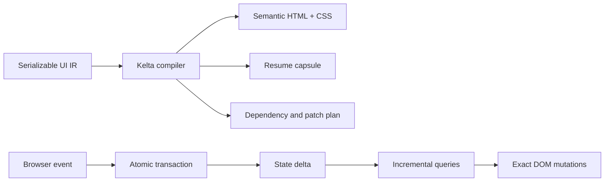

<p align="center">
  
</p>

# Kelta

Kelta is an experimental frontend compiler that treats the DOM as a materialized view of application state. Events commit typed transactions; state deltas flow through incremental queries into exact DOM mutations.

```text
DOM = View(State)
ΔDOM = derivative(View, ΔState)
```

There are no runtime components, render-function replays or virtual DOM trees. Kelta compiles a constrained, serializable application graph into semantic server HTML, a resume capsule, static dependency routes and direct browser patches.

> Research status: the core execution model is working and tested. Kelta is not yet a production framework.

## Why Kelta?

The name combines **kinetic** and **delta**: motion produced by change. The compiler's job is not to rerender an application—it derives the smallest valid output change from an input delta.

The prototype demonstrates:

- atomic transactions with rollback and write coalescing;
- normalized keyed tables rather than opaque object graphs;
- incrementally maintained filtered/ordered collections;
- incrementally maintained `count` and `sum` aggregates;
- exact text, property and class updates;
- keyed insertion, removal and identity-preserving movement;
- server rendering and browser resumption without view replay;
- delegated event routing without serialized closures;
- zero third-party runtime or build dependencies.

## Quick start

Node 20 or newer is sufficient.

```sh
npm ci
npm run check
npm run dev
```

Open [http://127.0.0.1:4173](http://127.0.0.1:4173). The final command builds and serves the example application.

Individual commands:

```sh
npm test        # compiler, runtime, transaction and marker semantics
npm run build   # SSR HTML, resume capsule and browser plan
npm run bench   # 10,000-row incremental engine proof
npm run serve   # serve an existing dist/ build
```

## How it works



An application declares five things:

1. Typed scalar cells and normalized keyed tables.
2. Pure collection and aggregate queries.
3. Atomic transactions.
4. A semantic DOM projection.
5. Explicit event routes.

The example in [`examples/tasks/app.js`](examples/tasks/app.js) is authored through small helpers, but the resulting artifact is plain serializable data—an AI or another language frontend could emit the same IR directly.

```js
const visibleTasks = collection("tasks", {
  where: calc.contains(
    calc.lower(ref.field("title")),
    calc.lower(ref.cell("search")),
  ),
  orderBy: "rank",
});

const toggle = transaction({
  params: { id: "number" },
  do: [mutate.toggleField("tasks", ref.param("id"), "done")],
});
```

Changing `tasks[id].done` produces a field delta. The runtime updates two aggregates, the relevant checkbox property and its row class. It does not execute a component or reconcile a list.

Changing `tasks[id].rank` updates the ordered projection and moves the existing DOM node. Focus, selection, form values and other browser-owned state remain attached to that node.

## Resumption

At build time the compiler evaluates initial queries and renders HTML. Sparse markers identify only dynamic text, bound elements, event routes and collection boundaries. The browser runtime scans those markers, retains direct node references and installs delegated listeners.

It does not execute the view again or reconstruct a component ownership tree. Each build writes an intentionally inspectable `dist/plan.json`, and `window.__KELTA__` exposes the engine and its latest transaction journal in the demo.

## Benchmark contract

The included benchmark creates 10,000 rows and then changes one row's sort key. The important result is algorithmic, not a machine-specific timing claim:

```json
{
  "scalarPatches": 1,
  "structuralOperations": 1,
  "fullCollectionReconciliations": 0
}
```

See [`docs/benchmarks.md`](docs/benchmarks.md) for methodology and the workloads required before making broader performance claims.

## Repository map

```text
src/ir.js                 serializable authoring IR
src/compiler.js           validation, dependency compilation and SSR
src/runtime/engine.js     transactions and incremental query maintenance
src/runtime/browser.js    resumption, delegated events and DOM patches
examples/tasks/           compiled demonstration application
benchmarks/engine.mjs     10,000-row delta benchmark
test/                     compiler and runtime behavior
docs/architecture.md      semantics, guarantees and deliberate limits
ROADMAP.md                staged path from prototype to credible system
```

## Deliberate limits

Version 0.1 supports scalar cells, keyed tables, filtered/ordered collections, `count`/`sum`, one-root row templates and synchronous transactions.

It does not yet include async resources, server actions, joins/groups, nested collection regions, cost-based query planning, event-level chunking, worker placement, foreign DOM ownership or a production optimizer. These are tracked in [`ROADMAP.md`](ROADMAP.md).

## Contributing

Read [`CONTRIBUTING.md`](CONTRIBUTING.md) before proposing semantics. Kelta should earn complexity only when it measurably improves startup, update work, correctness or operability.

Security issues should follow [`SECURITY.md`](SECURITY.md). Participation is governed by the [`CODE_OF_CONDUCT.md`](CODE_OF_CONDUCT.md).

## License

[MIT](LICENSE) © 2026 Kelta contributors.
